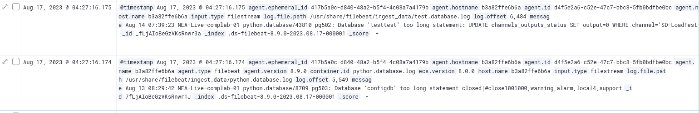

# Message
``` 
GET _cat/indices 
```
``` 
PUT .ds-filebeat-8.9.0-2023.08.23-000001/_mapping
{
  "properties": {
    "message" : {
      "type" : "match_only_text",
      "fields": {
        "keyword": {
          "type" : "keyword"
        }
      }
    }
  }
}
```
```
POST .ds-filebeat-8.9.0-2023.08.23-000001/_update_by_query?wait_for_completion=false
```
```
POST .ds-filebeat-8.9.0-2023.08.23-000001/_search
 {
  "size": 0,
  "aggs": {
    "type_promoted_count": {
      "cardinality": {
        "field": "message.keyword"
      }
    }
  }
}
```


# Filters
- ## Extension 
```{
  "bool": {
    "minimum_should_match": 1,
    "should": [
      {
        "wildcard": {
          "message": "*.mpd*"
        }
      },
      {
        "wildcard": {
          "message": "*.h3u8*"
        }
      }
    ]
  }
}
```
- ## Latency
```
{
  "script": {
    "script": {
      "source": "def filepath = doc['log.file.path'];if(filepath.size() == 1 && filepath.value.contains('remotelogs/')){def message = doc['message.keyword'];if(message.size()==1){def amount = message.value.splitOnToken(' '); if(Integer.parseInt(String.valueOf(amount[11])) > 2000){return amount != null;}}}"
    }
  }
}
```

# Code

- ## Endpoint
```
def filepath = doc['log.file.path'];
if(filepath.size() == 1 && filepath.value.contains('remotelogs/')){
    def message = doc['message.keyword'];
    if(message.size()==1){
    def amount = message.value.splitOnToken(' ');
        emit(amount[12] + ' ' + amount[13])
    }
}
```
- ## Latency
```
def filepath = doc['log.file.path'];
if(filepath.size() == 1 && filepath.value.contains('remotelogs/')){
    def message = doc['message.keyword'];
    if(message.size()==1){
    def amount = message.value.splitOnToken(' ');
        emit(amount[11])
    }
}
```